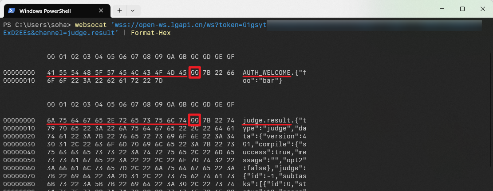

import ApiSchema from '@theme/ApiSchema';

# 异步结果推送

对于异步请求，平台提供两种消息推送方案：WebSocket 模式和 HTTP callback 模式，OpenApp 可以自行在控制台配置。无论选择哪种模式获得的数据都是一致的。对于公网可以访问的 OpenApp，我们推荐使用 HTTP callback 模式，否则建议使用 WebSocket 模式。

:::note 什么是异步

异步区别于同步，在调用一个 API 时，异步的请求尽管是成功的，但是只能拿到一个 ID，真正的结果不会立刻返回。

假设评测一道题目需要消耗 30 秒时间，如果同步返回的话，需要维持一个 30 秒的长 HTTP 连接，不确定因素很大。但是我们因此使用异步的方式：结果不会立刻返回，而是返回一个请求 ID。OpenApp 后续可以通过 ID 获取执行的结果。

:::

为了方便 OpenApp 识别消息相关的内容，所有异步请求在提交时都有一个字段：

<ApiSchema id="open" pointer="#/components/schemas/AsyncRequestCommon" />

平台会在异步操作完成时，将结果 POST 到 HTTP callback URL 或发送到相关的 WebSocket 频道，并附上 `trackId` 和 `requestId` 以方便用户区分结果对应的请求：

<ApiSchema id="open" pointer="#/components/schemas/AsyncResultCommon" />

:::tip

虽然异步请求都有结果查询的 API，但为了提高效率、减轻平台计算负担，我们推荐优先使用消息推送。尽管如此，消息推送的成功与否是不能保证的。因此在根据消息推送获得结果的同时，仍需对长时间未返回执行结果的请求调用结果查询接口来检查运行状态。

:::

## HTTP callback 模式

在控制台配置了 OpenApp 的 HTTP callback URL 之后，异步调用结果会通过 HTTP POST 发送到 OpenApp 设置的 callback URL。

为了保证结果的完整和可信，在 callback 时还会加入一个名为 `Luogu-API-Callback-Sign` 的 HTTP Header，这个 Header 值使用这样的规则计算：`base64_encode(sha256_hmac(trim('{HTTP Header Date}\r\n{HTTP Request Body}'), '{OpenApp Token}'))`。

假设接收这个 callback 的 OpenApp 的 token 为 `01gt8s4bnbesna15e9f6wvk5pn:w1MmbjBCsDYjXpgS`，那么对于下面这个 callback 请求：

```
POST /callback HTTP/1.1
Date: Fri, 17 Mar 2023 06:34:25 GMT
Luogu-API-Callback-Sign: dkY3sq6VvxAVtLnW/lpyP65pkYgwwrZTerLP+VJ/D8k=

{"success":true}
```

可以类似这样进行验证：

```php
$token = '01gt8s4bnbesna15e9f6wvk5pn:w1MmbjBCsDYjXpgS';
$data = trim($_SERVER['HTTP_DATE']."\r\n".file_get_contents('php://input')); // 此时值为 "Fri, 17 Mar 2023 06:34:25 GMT\r\n{\"success\":true}"
$sign = hash_hmac('sha256', $data, $token, true);
$verified = $sign === base64_decode($_SERVER['HTTP_LUOGU_API_CALLBACK_SIGN']);
```

## WebSocket 模式

对于公网无法直接访问的 OpenApp，可以选择 WebSocket 模式接收消息推送。

洛谷开放平台的 WebSocket 端点为 `wss://open-ws.lgapi.cn/ws?token=<token>&channel=<channels>`，它的 query 参数解释如下：

<ApiSchema id="open" pointer="#/components/schemas/WebSocketQueryParam" />

平台进行消息推送时具有这样的结构：`"channel name" + "\x00" + "message"`，WebSocket Message 类型为 Text，如下图所示。



只要 WebSocket 连接成功即为鉴权成功，连接成功后服务器也会在 `AUTH_WELCOME` 频道（不需要订阅）发送一条消息。如果参数有误或 token 失效，会在连接建立之前以对应的 HTTP 状态码展示。

:::note

每个 App 的连接数限制为 3，如果超过限制会导致较早打开的连接被踢出，服务器每隔 30 秒会发送一次 PING 帧以保持 TCP 连接活跃。

:::
